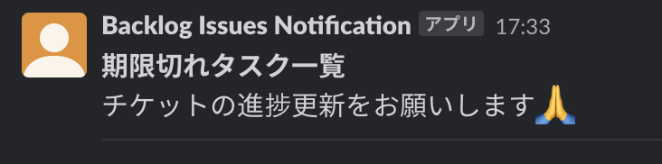
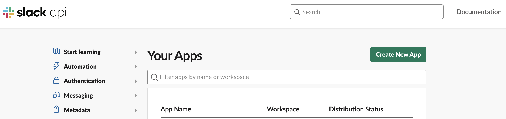
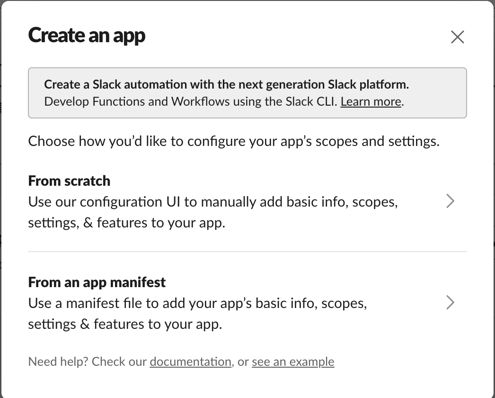

<!--
Copyright (c) 2023 Ryuichiro Semba Co., Ltd. All Rights Reserved.

Licensed under the Apache License, Version 2.0 (the "License");
you may not use this file except in compliance with the License.
You may obtain a copy of the License at

      http://www.apache.org/licenses/LICENSE-2.0

Unless required by applicable law or agreed to in writing, software
distributed under the License is distributed on an "AS IS" BASIS,
WITHOUT WARRANTIES OR CONDITIONS OF ANY KIND, either express or implied.
See the License for the specific language governing permissions and
limitations under the License.
-->
# notice-slack-backlog-issues

## Overview



Backlog の期限切れタスクを Slack へ通知するためのリポジトリです。

インフラは Google Apps Script の実行環境を利用し、ソースコードは Google Clasp で管理できるようにしています。

## Requirement

- Node.js
    - v20.7.0
- npm
    - 10.1.0

Other libraries are [here](./package.json)

## Library

Google ASIDE を利用して Clasp、Type Script、Jest などを引き込んでいます。

- Apps Script in IDE (ASIDE)
    - https://github.com/google/aside

これに加えて、node modules は GAS の実行環境では引き込めないため、  
rollup を利用してトランスパイル時に必要なものだけバンドル化しています。

## How To Cotribute

See [CONTRIBUTING.md](./docs/CONTRIBUTING.md)

## Usage

### 1. パッケージのインストール

npmを使用して必要なパッケージをインストールします。

```shell
npm -i
```

### 2. Googleアカウントの認証

下記コマンドを実行してGoogleへの認証を行います。
認証することでGoogle環境とファイルのやり取りができるようになります。

```shell
clasp login
```

コマンドを実行すると、ターミナル上に以下のようなURLが出力されます。  
このアドレスへアクセスすると、ログインと権限の許可が求められます。

実行例

```shell
~/ghq/github.com/semba-yui/notice-slack-backlog-issueson  main [?] is 📦 v1.0.0 via  v20.7.0 
$ clasp login                    
Logging in globally…
🔑 Authorize clasp by visiting this url:
https://accounts.google.com/o/oauth2/v2/auth?access_type=offline&scope=hoge # ← この URL をクリック

Authorization successful.

Default credentials saved to: /Users/semba/.clasprc.json.
```

### 3. 環境変数の設定

プロジェクトに環境変数（スクリプト プロパティ）を設定していきます。

※ `.env` ファイルはローカルのみに保持し、コミットしないこと。

```shell
cp .env.example .env
```

`.env` に適切な環境変数を設定する。

 

 

#### 1. BACKLOG_API_KEY について

##### 1. 個人設定を選択


##### 2. API から API キーを登録

> **Warning**  
> 権限の選択等は一切ありません。  
> とても危険なので取り扱いは十分に気をつけること。


払い出した API キーは `BACKLOG_API_KEY` として設定します。

#### 2. BACKLOG_PROJECT_ID について

管理画面の URL のパスパラメータから確認します。


例: `https://hoge.backlog.jp/EditProject.action?project.id=00001` の場合、
`BACKLOG_PROJECT_ID` には `00001` を設定します。

#### 3. BACKLOG_PROJECT_URL について

Backlog の Project URL を設定します。 

例: `https://hoge.backlog.jp` の場合、`hoge` を `BACKLOG_PROJECT_URL` に設定します。

#### 4. SLACK_CHANNEL_URL について

通知対象の Slack Channel ID を設定する。

https://auto-worker.com/blog/?p=132 参照。

#### 5. SLACK_BOT_TOKEN について

Note 参照。

### 4. build

```shell
~/ghq/github.com/semba-yui/notice-slack-backlog-issues on  main [!?] is 📦 v1.0.0 via  v20.7.0 took 2s 
$ npm run build

> notice-backlog-ticket@1.0.0 build
> npm run clean && npm run bundle && ncp appsscript.json dist/appsscript.json


> notice-backlog-ticket@1.0.0 clean
> rimraf build dist


> notice-backlog-ticket@1.0.0 bundle
> rollup --no-treeshake -c rollup.config.mjs
```

## Note

### Slack API の Token を払い出す

#### 1. Slack App を新規作成する

https://api.slack.com/apps にアクセスし、`Create New App` を選択する。



From Scratchを選択する。



- App Name: アプリの名称
- Pick a workspace to develop your app in: アプリをインストールするワークスペース

#### 2. 適切な権限を付与する

OAuth & Permissions のページを開き、Scopes にて以下の権限を全て付与する。

- `users:read`
- `users:read.email`
- `chat:write`

#### 3. ワークスペースへインストールする

`OAuth Tokens for Your Workspace` の下部にある Install to Workspace を選択し、ワークスペースへインストールする。  

これにより、Bot User OAuth Token が払い出されるため、この値を `.env` に設定して利用する。

#### 4. 通知対象の Slack Chat に Slack App のアカウントを招待する

メンションすると招待できる。
 
## Author

- Ryuichiro Semba

## License

See [LICENSE](./LICENSE)
